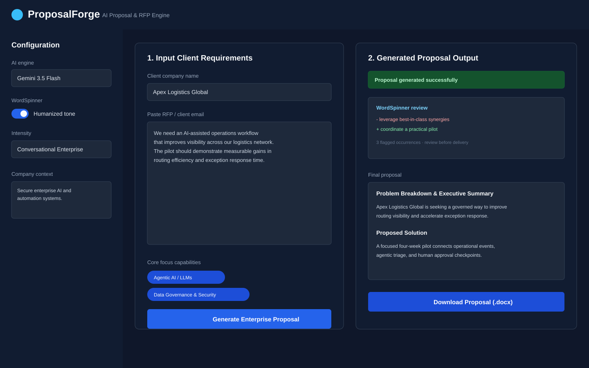

# ProposalForge

ProposalForge is a Streamlit workspace for turning client RFPs and email requests into structured enterprise proposals. It combines an OpenAI-compatible model request, a strict proposal schema, deterministic WordSpinner review, and formatted Word export.



## What it does

- Accepts a client name, RFP text, capability selections, and company context.
- Generates five proposal sections through a required `submit_proposal` tool call.
- Validates the model response against a strict schema before displaying or exporting it.
- Flags dictionary buzzwords case-insensitively with sentence and source locations.
- Shows a before/after review diff without silently changing the proposal.
- Supports an injectable sentence-level rewriter for targeted humanization.
- Creates a branded `.docx` file with a cover page, headings, bullets, page breaks, and document metadata.
- Keeps configuration in environment variables or Streamlit secrets, with a session-only API-key fallback.

## Proposal structure

Every successful generation contains these required fields:

1. `executive_summary` — problem breakdown and executive summary
2. `proposed_solution` — proposed solution and AI agent architecture
3. `pilot_roadmap` — four-week pilot roadmap and key deliverables
4. `why_our_company` — company strengths and fit
5. `next_steps` — clear next actions

The provider must return the fields through the strict `submit_proposal` function tool. A missing tool call, invalid JSON, missing field, or empty field is treated as a malformed response.

## WordSpinner

WordSpinner uses a deterministic dictionary rather than a probabilistic rewrite pass. The default UI runs it in review mode: it reports every match, its sentence, and its line and column, while leaving the proposal unchanged.

Illustrative review diff:

```diff
- We will leverage a robust, best-of-breed solution to unlock the potential of our operations.
+ We will run a focused pilot to improve routing visibility and response time.
```

The default application is intentionally review-first. Code that wants automatic replacement can inject a rewriter:

```python
from wordspinner import WordSpinner

spinner = WordSpinner(rewriter=lambda sentence, hits: sentence.replace("leverage", "use"))
result = spinner.spin(proposal_text)
```

The rewriter is called only for sentences containing matches, and it may return `None` to leave a sentence unchanged.

## Architecture

```text
                         browser / Streamlit
                                  |
                                 app.py
                                  |
                       proposal_pipeline.py
                         /       |        \
                prompts.py  llm_client.py  export.py
                    |            |              |
          structured prompt   OpenAI API   python-docx (.docx)
                                 |
                         proposal_schema.py
                    strict submit_proposal validation
                                 |
                         wordspinner.py
                    deterministic review and rewrite API

config.py and .env provide provider settings and company context.
```

The modules are intentionally separated so prompt construction, provider access, validation, review, and export can be tested or replaced independently of the Streamlit UI.

## Requirements

- Python 3.12+
- An API key for an OpenAI-compatible provider
- An internet connection for model requests

The default configuration targets the Gemini OpenAI-compatible endpoint. OpenRouter can be selected through the corresponding environment variables.

## Local setup

From the repository root:

```bash
python3.12 -m venv env
source env/bin/activate
python -m pip install --upgrade pip
python -m pip install -r requirements.txt
cp .env.example .env
```

Edit `.env` and set a provider key:

```dotenv
GEMINI_API_KEY=replace-with-your-key
```

For OpenRouter, use:

```dotenv
OPENROUTER_API_KEY=replace-with-your-key
OPENROUTER_BASE_URL=https://openrouter.ai/api/v1
MODELS=your-compatible-model
```

Start the application:

```bash
streamlit run app.py
```

`streamlit run main.py` remains supported as a compatibility entry point. Streamlit serves the app at `http://localhost:8501` by default.

## Configuration

| Variable | Purpose | Default |
| --- | --- | --- |
| `GEMINI_API_KEY` | Primary provider key | — |
| `OPENROUTER_API_KEY` | Alternate provider key | — |
| `API_BASE_URL` | OpenAI-compatible API base URL | Gemini endpoint |
| `OPENROUTER_BASE_URL` | OpenRouter base URL | OpenRouter endpoint |
| `MODELS` | Comma-separated model choices | Gemini defaults |
| `COMPANY_CONTEXT` | Company capabilities and proof points | Built-in profile |

The app also checks `GEMINI_API_KEY` and `OPENROUTER_API_KEY` through Streamlit secrets. If neither source provides a key, the sidebar offers a password-style field that is held only for the current Streamlit session and is not written to disk.

## Usage

1. Start the app and provide a key through `.env`, Streamlit secrets, or the session-only sidebar field.
2. Choose a model and configure company context.
3. Paste the client RFP or email and select the relevant capabilities.
4. Generate the proposal.
5. Review WordSpinner hits and the structured sections.
6. Copy the final text or download the generated `.docx` file.

The app does not persist RFPs or generated proposals to a database, file, or history store. Save any output you need before ending or refreshing the Streamlit session.

## Development

Install the development dependencies from `requirements.txt`, then run:

```bash
pytest
ruff check .
```

The test suite covers prompt construction, schema validation, WordSpinner detection and rewriting, DOCX generation, configuration, mocked LLM calls, and provider error handling. GitHub Actions runs the same commands on pushes and pull requests using Python 3.12.

## Project structure

```text
ProposalForge/
├── app.py                    # Streamlit UI
├── main.py                   # Compatibility launcher
├── config.py                 # Dotenv-backed settings
├── prompts.py                # Proposal prompt construction
├── llm_client.py             # Provider calls and error mapping
├── proposal_schema.py        # Strict tool schema and parser
├── proposal_pipeline.py      # Generation orchestration
├── wordspinner.py            # Deterministic buzzword review
├── export.py                 # Word document generation
├── errors.py                 # User-facing application errors
├── docs/ui-preview.svg       # Interface preview
├── tests/                    # Pytest-compatible test suite
├── .github/workflows/ci.yml  # CI lint and test workflow
├── .env.example              # Safe configuration template
├── LICENSE
├── requirements.txt
└── pyproject.toml
```

## License

Released under the MIT License. See [`LICENSE`](LICENSE).
